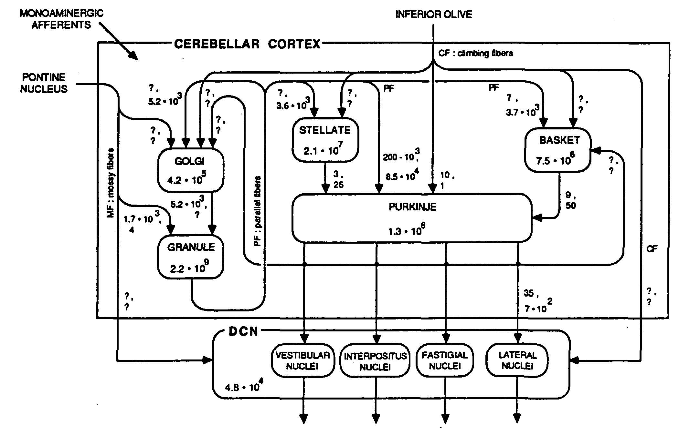

**********************************
About the Pseudocerebellum project
**********************************

The aim of the project is to gather information about the cerebellum
that could lead to the engineering of efficient associative memories
for man-made systems.  The project is organized around a website that
collects and abstracts information about the cerebellum as an
associative memory.  The website is meant to be a community effort.
Ideally, it will build a table with an entry for each neuron type in
the cerebellum, the number of neurons of that type, what neurons they
connect to with what fan-ins and fan-outs, nature of connections
(excitatory, inhibitory), and firing rate (typical, range).  This kind
of information can be seen in Figure 2 by Loebner (1989)  :cite:`LoebnerEE-1989`.  In addition
to wiring, we want the information to be sufficient for realistic
estimation of the cerebellum's energy use.

   Figure 2 in Loebner, 1989 :cite:`LoebnerEE-1989`.

The table is referred to as "Cerebellum Facts."  Each "fact" is
accompanied by a reference to the source.  In addition to the list of
references, the website will include an annotated bibliography, to help
viewers navigate the material.  The annotations are informal, more
like comments.  They are written by us participants in the website and
are meant to point out particulars about a paper that have struck us
as significant and likely to be helpful to others.

Why the Cerebellum?
===================

Human and animal memories work by association.  Among the brain's
circuits, the cerebellum's looks the most like an associative memory.
It is highly regular, has a small number of neuron types but more
neurons overall than the rest of the brain (Llinas, 1975) :cite:`LlinasRR-1975`, and it has
been modeled mathematically since Marr's theory of cerebellar cortex
(1968) :cite:`MarrD-1969`.  Among models of the brain's circuits, the cerebellum's is
perhaps the most comprehensive and informative.

Cerebellum's importance for motor coordination was established long
ago.  We therefore expect that information on this website will help
us build more agile robots.  There is increasing evidence that the
cerebellum is equally important for higher cognitive functions,
including language.  Since the problems of language motivated the
development of high-dimensional computing--Plate's (2003) HRR :cite:`PlateTA-2003` and its
kin--cerebellum-like associative memory is likely to be important for
all kinds of learning, not just for learning of motor control.  Its
huge number of neurons and synapses suggests a capacity that is large
enough to support learning over a lifetime.  We view such a memory as
essential for sensor-motor learning and cognition that brains are
capable of.

Pseudocerebellum is an associative memory for high-dimensional
vectors--for vectors with thousands of dimensions.  When cued with a
vector, it finds the most similar vector or vectors among a set of
stored vectors: its function is k-nearest-neighbor search among tens
of thousands of high-dimensional vectors.  Associative memory is a key
component of an architecture for computing with high-dimensional
vectors--for "hyperdimensional" computing.  Building a fast and
energy-efficient associative memory is a major engineering challenge.

The website is for gathering information about the cerebellum that
could lead to the engineering of efficient associative memories for
high-dimensional vectors.  Research of this kind was began in the
1980s and presented by Egon Loebner (1989) in a paper on "Intelligent
network management and functional cerebellum synthesis" at IEEE
COMPCON Spring 1989 :cite:`LoebnerEE-1989`, but not followed up on.  However, new ideas about
computing with vectors, starting with Plate's Holographic Reduced
Representation (HRR; 1991 :cite:`PlateTA-1991`, 2003 :cite:`PlateTA-2003`), have made the building of an
efficient associative memory into a practical problem of major
significance.

We will start with neuroanatomy.  Where do inputs to the cerebellum
come from and in what numbers?  Where do outputs go and in what
numbers?  What connections are internal to the cerebellum, and again
in what numbers?  The paper by Loebner serves as a model.  Its numbers
refer to the cerebellum of the cat.  We want those connections and
numbers also for the human brain and will collect them into a table
with an entry for each neuron type.  In addition to connections and
numbers, the table will include references, with page numbers, to
where the information is found.

In addition to cerebellum facts and references, the website will have
comments written by us highlighting the reasons for including the
paper in the website.  Please tell us in your comment what caught your
attention, what did you learn, what might be helpful for someone else?

Models of the Cerebellum
========================

Three mathematical models of the cerebellum interpret it as an
associative memory, Marr's (1969) :cite:`MarrD-1969` from neuroscience perspective,
Albus' (1971) :cite:`Albus-1971` from engineering perspective, and Kanerva's (1988)
:cite:`KanervaP-1988` from cognitive science and
computing perspective.  All three assign identical functions to two
prominent cell types and two main kinds of input.  (1) Mossy fibers
bring in information from the rest of the nervous system.  (2) Granule
cells distribute it within the cerebellar cortex.  Information is
stored in (3) Purkinje-cell synapses with granule-cell dendrites.
Purkinje cells provide the sole output, and (4) climbing fibers
provide an error signal when the output differs from the desired
output.  This is known as the Marr-Albus model.

Marr's paper is not an easy read.  Tyrrell \& Willshaw (1992) :cite:`TyrrellT+WillshawD-1992` help us
digest it by animating it with simulation.  Albus treats the circuit
as an engineering object applicable to robotic control (CMAC =
Cerebellar Model Articulation Controller; Albus 1981 :cite:`Albus-1981`).  Kanerva likens it to
a computer memory for high-dimensional data (SDM = Sparse Distributed Memory; Kanerva
1989) :cite:`KanervaP-1988`.  Kanerva (1989) :cite:`KanervaP-1988` provides background for Jaeckel's (1989a, 1989b)
:cite:`JaeckelLA-1989a,JaeckelLA-1989b`
alternate designs for SDM.

When the cerebellum is viewed as a memory, each granule cell
represents a memory location.  The contents of a location are along
its axon, called parallel fiber, where it makes contact with
Purkinje-cell dendrites.  Climbing fibers are a telltale feature of
the circuit, as each Purkinje cell is paired with a single climbing
fiber which is ideally situated for "training" the Purkinje cell; see
Figs. 1 and 2 of D'Angelo and Casali (2013) :cite:`DAngelo+Casali-2013`.  See also Kandel,
Schwartz & Jessell (2000) Chapter 42 on the cerebellum :cite:`Kandel_and_Schwartz-2000` and images that
Google returns for "cerebellar circuitry."

The cerebellum "memory" differs from computer memory in one important
aspect: computer memory is accessed one location at a time, whereas a
single read or write operation in the cerebellum involves multiple
locations (granule cells).  It differs also from most neural-net
models: granule-cell activations are all-or-none and only a tiny
fraction of all possible locations/granule cells is active at
once--activation is exceedingly sparse, perhaps one in 10,000.
Furthermore, the lack of multiple layers eliminates the need for error
backpropagation.  Learning is fast, and very large information
capacities are readily accommodated.

Neural associative memories store every piece of information in
multiple locations.  A data vector associated with a cue is superposed
in--added into--every location activated by the cue, and upon
retrieval it is reconstructed from the contents of the locations
activated by the cue.  To make memory retrieval noise-tolerant,
similar cues activate many of the same locations, whereas the overlap
is minimal when the cues are dissimilar.

Looking to Be Efficient
=======================

We think of autonomous robots as man-made animals with silicon
brains--that's what "bio-inspired" often means--and we want robot
brains to match real brains in their function and energy efficiency.
Computing with high-dimensional vectors is assumed to provide some of
the functionality and relies fundamentally on an associative memory.
The activation algorithm has a crucial role in making the memory work.
Activation of sparse distributed memory (SDM) satisfies the overlap
condition referred to above but requires excessive computing.  Nor
does it correspond to what we see in the cerebellum.

To determine which locations to activate, SDM computes Hamming
distances between high-dimensional vectors, implying that the granule
cells should have hundreds or thousands of inputs when, in fact, they
have only 3-6.  Two models by Jaeckel (1989a, 1989b) :cite:`JaeckelLA-1989a,JaeckelLA-1989b` deal with this
discrepancy, the Selected-Coordinate Design when the high-dimensional
cue vectors are dense, and the Hyperplane Design when they are sparse.
In both designs a location is activated if its "address" matches the
cue in a small subset of coordinates specific to the location.
Jaeckel's designs should interest engineers by being energy efficient.
Of the two, the hyperplane design is closer to cerebellum's.

Digital Implementation
======================

By digital I mean ordinary computer.  Associative memory can then be
realized as a table that stores every vector known to the system.  The
cue vectors are noisy, and finding the most similar vector or vectors
in the table becomes the problem to solve.  Comparing the cue to every
vector in the table is practical only when the number of stored
vectors is small, and so we need an efficient algorithm for
k-nearest-neighbor search of large data sets.  An algorithm by Li and
Malik (2017) :cite:`LiK+MalikJ-2017` may be the solution.

Karlsson's (2001) :cite:`KarlssonR-2001` Fast Activation Mechanisms is an efficient
realization of Jaeckel's selected-coordinate design.

ORGANIZING THE WEBSITE
======================

We hope to make the website into a source of information and a place
of self-study.  It is focused narrowly on the cerebellum as an
associative memory, and is concerned more with anatomy than with
physiology.  Even that can be much to keep up with, considering the
volume of research published every year.

We are new at setting up a website of this kind and have used Stanford
Encyclopedia of Philosophy as a model: https://plato.stanford.edu/
although our effort is tiny in comparison and more tightly focused.
We hope to make the website into a useful collection of cerebellum
facts that is easy to navigate and contribute to.  So when you have
information that is missing, or see "facts" that need updating, we
appreciate your passing them on to us for inclusion in the website.
Email the information to

  pseudocerebellum@berkeley.edu

Funding for the project has been provided by Air Force Office of
Scientific Research and DARPA Defense Science Office.

Fri Oct  4 11:38:48 PDT 2019

Pentti Kanerva

UC Berkeley, Redwood Center for Theoretical Neuroscience

