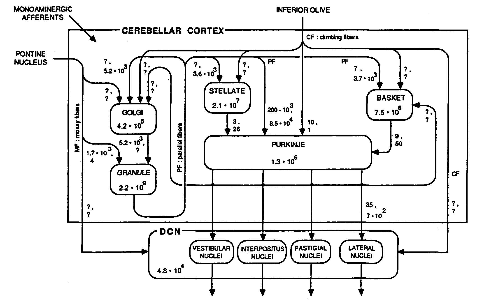

.. Tue Oct 13 10:12:44 PDT 2020

****************************
THE PSEUDOCEREBELLUM PROJECT
****************************

Pentti Kanerva, Jeff Teeters and Bruno Olshausen

pseudocerebellum@berkeley.edu

Editors' note, October 13, 2020: This website is under construction,
your comments are welcome.

**********************************
About the Pseudocerebellum project
**********************************

Synopsis
========

Our lives depend on remembering a myriad of things learned over a
lifetime.  Learning and remembering is what brains do, but how?  If we
understood it in theory, we could begin to build artificial systems
with traits somewhat like ours.

The aim of this project is to gather information about the cerebellum
that could lead to the engineering of an efficient, high-capacity
memory for artificial systems.  By "memory" we mean a physical
structure for storing information--in the humanities "memory" is
something more abstract: a mental state or image recalled from the
past.  The project is organized around a website that collects and
abstracts information about the cerebellum as an associative memory.
The website is meant to be a community effort.  Ideally, it will build
a table with an entry for each neuron type in the cerebellum, its
location, the number of neurons of that type, what neurons they
connect to with what fan-ins and fan-outs, nature of the connections
(excitatory, inhibitory), and firing rate (typical, range).  The table
is referred to as "Cerebellum Facts."  Each "fact" is accompanied by a
reference to the source and a page number.  Information of this kind
was compiled already in the 1980s by Loebner (1989)
:cite:`LoebnerEE-1989`; see his Figure 2 below.  In addition to the
"wiring," we want the information to be sufficient for a realistic
estimation of the cerebellum's energy use.

   Figure 2 in Loebner (1989) :cite:`LoebnerEE-1989`.

In addition to the list of references, the website will include an
annotated bibliography, to help viewers navigate the material.  The
annotations are informal, more like comments.  They are written by us
who want to participate in the website and are meant to point out
particulars about a paper that have struck us as significant and
likely to be helpful to others.

Why the Cerebellum?
===================

The simple answer is its very size: the human cerebellum has many more
neurons than the rest of the brain (Llinas, 1975)
:cite:`LlinasRR-1975`.  The cerebellum's importance for motor control
was established long ago.  We can therefore expect that understanding
it will help us build more agile robots.  There is increasing evidence
that the cerebellum is involved also in mental functions, including
language.  With its huge numbers of neurons and synapses, the
cerebellum would have the capacity to store a lifetime of learning.  A
relatively simple neural structure with over half the brain's neurons
deserves a major role in our models of brain function.

Human and animal memory works by association.  Among the brain's
circuits, the cerebellum's looks the most like an associative memory.
A small number of neuron types is organized in a uniform
three-dimensional structure that has been modeled mathematically since
Marr's theory of cerebellar cortex (Marr, 1969) :cite:`MarrD-1969`.
Among mathematical models of the brain's circuits, the cerebellum's is
perhaps the most compelling.

Models of the Cerebellum
========================

Three mathematical models of the cerebellum interpret it as an
associative memory: Marr's (1969) :cite:`MarrD-1969` from a
neuroscience point of view, Albus' (1971) :cite:`AlbusJS-1971` from an
engineering point of view, and Kanerva's (1988) :cite:`KanervaP-1988`
from computer and cognitive science points of view.  All three assign
identical functions to two prominent cell types, the Granule Cells and
the Purkinje Cells, and to two main kinds of input, the Mossy Fibers
and the Climbing Fibers.  The mossy fibers bring in information from
the rest of the nervous system--they represent the system's sensory
state--the granule cells distribute it within the cerebellar cortex,
information is stored in the Purkinje-cell synapses with granule-cell
axons, the Purkinje cells provide the sole output, and the climbing
fibers provide an error signal when the output differs from the
desired output.  This is known as the Marr-Albus model.

When the cerebellum is viewed as a memory and is compared to the
memory of a computer, each granule cell represents a memory location.
The contents of a location are along its axon, called the parallel
fiber, which intersects multiple Purkinje-cell dendrites that lie in
planes perpendicular to the parallel fibers.  Climbing fibers are a
telltale feature of the circuit, as each Purkinje cell is paired with
a single climbing fiber which is ideally situated for "training" the
Purkinje cell; see Figs. 1 and 2 of D'Angelo and Casali (2013)
:cite:`DAngeloE+CasaliS-2013`.  See also Kandel, Schwartz & Jessell
(2000) Chapter 42 on the cerebellum :cite:`KandelER+2-2000` and images
that Google returns for "cerebellar circuitry."  The layout is
basically the same as in the three-dimensional magnetic-core memory of
the 1960s.

The cerebellum "memory" differs from computer memory in two important
aspects: whereas computer memory is accessed one location at a time,
to reach the data specific to that location, a single "read" and
"write" action activates multiple locations (granule cells) of the
cerebellum.  The data are distributed and superposed with other data
in the activated locations.  The cerebellum differs also from most
neural-net models in that granule-cell activation is all-or-none and
only a tiny fraction of all possible granule cells is active at once:
activation is exceedingly sparse (perhaps one in a 1,000), learning is
fast (can take fewer than 10 trials), and the number of modifiable
synapses is very large (could be a million millions or more).

Even if the cerebellum were not exactly an associative memory we have
envisaged, understanding it as an engineering object can be of value
to fields such as robotics.  Cerebellum's importance for motor
learning and control is undisputed.

Computing with Vectors
======================

A significant new development in computing began with Plate's
Holographic Reduced Representation (HRR) in the 1990s
:cite:`PlateT-1991`.  It addressed the shortcomings of artificial
neural systems and rule-based AI, namely, neural nets struggled with
compositional structure such as in language, and rule-based AI
struggled with statistical learning from data.  The new idea is to
compute with high-dimensional vectors (e.g., D = 10,000) in a style
familiar to us from computing with numbers: the addition and
multiplication of vectors produce vectors of the same high
dimensionality.  The idea is covered thoroughly in the book
Holographic Reduced Representation (Plate 2003) :cite:`PlateTA-2003`,
it is summarized in a paper on "hyperdimensional" computing (Kanerva
2009) :cite:`KanervaP-2009`, and it is also called Vector Symbolic
Architecture (VSA; Gayler, 2003) :cite:`GaylerRW-2003`.  In analog to
computing with numbers, computing with high-dimensional vectors
requires a memory for the vectors, a large "high-D RAM."

The Pseudocerebellum Project
============================

Building a large associative memory for high-dimensional vectors is a
major engineering challenge.  Since nature appears to have solved it
by evolving the cerebellum, we want to understand its principles of
operation, hence the Pseudocerebellum Project.  This work was began in
the 1980s and was cited above (Loebner, 1989) :cite:`LoebnerEE-1989`.
It is all the more relevant now, after the advent of computing with
high-dimensional vectors.

The project website collects information about the cerebellum starting
with neuroanatomy.  Where do inputs to the cerebellum come from and in
what numbers?  Where do outputs go and in what numbers?  What
connections are internal to the cerebellum, and again in what numbers?
How does the circuit vary from one area of the cortex to another?  The
paper by Loebner serves as a model.  It pertains to the the cerebellum
of the cat; we want those connections and numbers also for the human
brain.

In addition to cerebellum facts and references, the website will have
comments written by us highlighting the reasons for including the
paper in the website.  Please tell us in your comment what caught your
attention, what did you learn, what might be helpful for someone else?

Looking to Be Efficient
=======================

We think of autonomous robots as artificial animals with silicon
brains--that's what "bio-inspired" often means--and we want robot
brains to match real brains in their function and energy efficiency.
Computing with high-dimensional vectors is expected to provide some of
the functionality, and it relies fundamentally on an associative
memory.  The activation algorithm has a crucial role in making the
memory work.

Activation of the Sparse Distributed Memory (SDM; Kanerva 1988)
:cite:`KanervaP-1988` requires the computing of Hamming distances
between high-dimensional vectors, implying that the granule cells
should have hundreds or thousands of inputs when, in fact, they have
only 3-6.  Two models by Jaeckel (1989a, 1989b)
:cite:`JaeckelLA-1989a` :cite:`JaeckelLA-1989b` deal with this
discrepancy, the Selected-Coordinate Design when the high-dimensional
cue vectors are dense, and the Hyperplane Design when they are sparse.
In both designs a location is activated if its "address" matches the
cue in a small subset of coordinates that are specific to the
location.  Jaeckel's designs should interest engineers by being energy
efficient.  Of the two, the hyperplane design is closer to the
cerebellum's.  The point is, when our models imply things not seen in
nature, we need to keep on looking for more realistic alternatives.

Digital Implementation
======================

By digital we mean an ordinary computer.  Associative memory can then
be realized as a table that stores every vector known to the
system.  The cue vectors are noisy, and finding the most similar vector
or vectors in the table becomes the problem to solve.  However,
comparing a high-dimensional cue to every vector in the table is
practical only when the number of stored vectors is small, and so we
need an efficient algorithm for nearest-neighbor search of large data
sets.  An algorithm by Li and Malik (2017) :cite:`LiK+MalikJ-2017` may
provide a solution.

Karlsson's (2001) :cite:`KarlssonR-2001` Fast Activation Mechanisms is an
efficient realization of Jaeckel's selected-coordinate design.

.. *******************************************************

RESOURCES
=========

Projects and Websites
=====================

1. CEREBELLAR PLATFORM is a Japanese collection of references to
cerebellar research up to 2018:

  https://cerebellum.neuroinf.jp/

2. HUMAN BRAIN PROJECT includes a section on the cerebellum

  https://www.humanbrainproject.eu/en/brain-simulation/cerebellum/

They gather information about the cerebellum with the aim of building
a biologically faithful simulation (D'Angelo et al., 2016)
:cite:`DAngeloE+11-2016`.  Much of the information is of interest also
to us.

3. COGNITIVE CONSILIENCE provides an interactive graphical interface
for tracing connections between neurons in different parts of the
brain (Solari & Stoner, 2011a,b) :cite:`SolariSVH+StonerR-2011a,SolariSVH+StonerR-2011b`

4. CEREBELLAR ATLAS VIEWER displays the activity (functional MRI) of
different parts of the cerebellum in a variety of tasks (King et al.,
2019a,b) :cite:`KingM+4-2019a,KingM+4-2019b`. 

Review Articles
===============
  

Mathematical Models Other than Associative Memory
=================================================

Fujita M (1982).  Adaptive filter model of the cerebellum.
  Biological Cybernetics 45(3):195-206.

Miyashita Y and Paulin M (1989).  A Kalman filter theory of the
  cerebellum.  Dynamic interactions in neural networks. pp. 239-259.
  Berlin, Heidelberg: Springer-Verlag.

Pellionisz A and Llinas R (1980).  Tensor approach to the geometry
  of brain function: Cerebellar coordination metric tensor.
  Neuroscience 5:1125-1136.

.. THAT'S ALL, FOLKS ..
.. Tue Oct 13 13:31:16 PDT 2020

