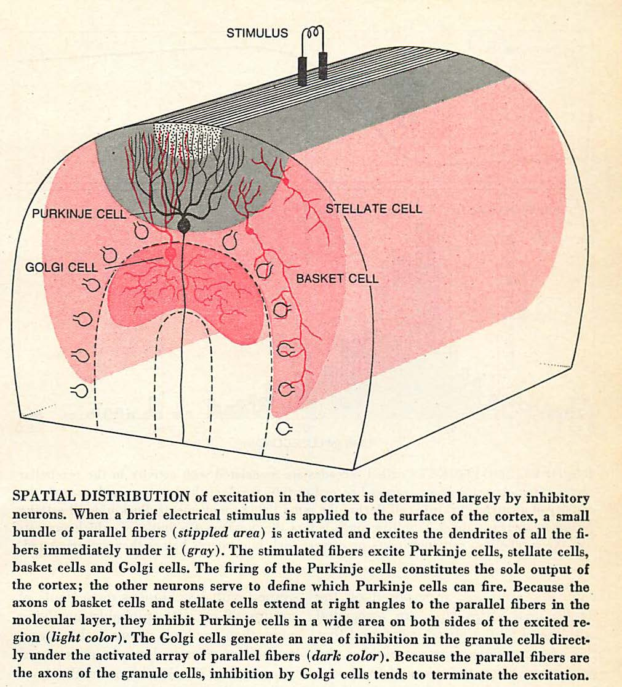
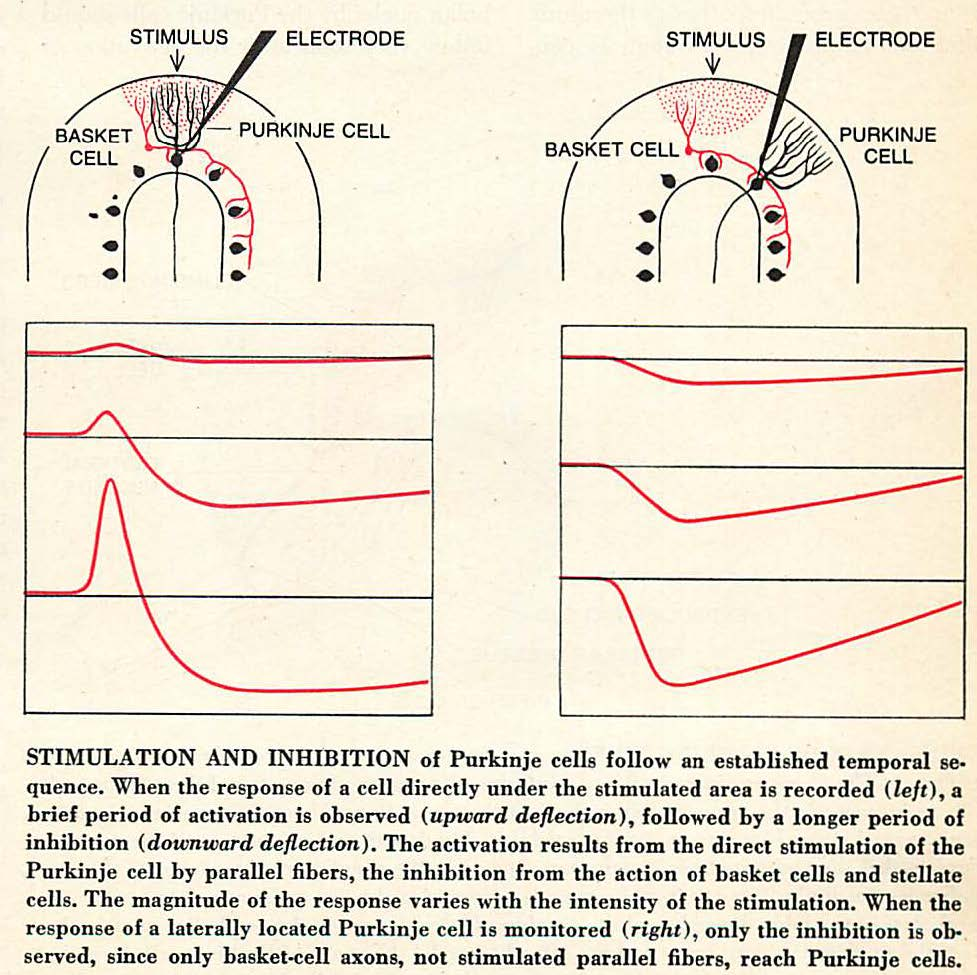

************
Basket cells
************

**Overview**
   (adapted from: http://www.scholarpedia.org/article/Cerebellum#Neuronal_types):
   
   Basket cells are interneurons found in the lower molecular layer
   which are inhibitory (GABAergic) on to Purkinje cells.  Their axons
   run in the same direction as the dendrites
   of the Purkinje cells, are electrically coupled, and
   receive both climbing fiber collaterals as well as parallel fibers
   originating in the granule layer.

   Their axons extend along the
   Purkinje cell layer at right angles to the direction of the parallel
   fibers. They may spread over a distance equal to 20 Purkinje cell
   widths and 6 deep and may contact as many as 150 Purkinje cell
   bodies. During its course, the horizontal segment of a basket cell
   axon sends off groups of collaterals that descend and embrace the
   Purkinje cell soma and initial segment. As many as 50 different basket
   cells are thought to wrap their axon terminals around each Purkinje
   cell soma, forming a basket-like meshwork resembling that on an old
   Chianti bottle (Hamori & Szentagothai, 1966). Basket cell axons also
   ascend to contact the Purkinje cell dendritic tree. There are about
   six times as many basket cells as Purkinje cells.
   

   Basket cell arrangement in cerebellar cortex. From :cite:`LlinasRR-1975`.

   Stimulation and inhibition of Purkinje cells. From :cite:`LlinasRR-1975`.

Data about basket cells:

Number of cells:  About 6x number of Purkinje cells.  For cat, this is
7.5x10^6.   See note for: :cite:`PalkovitsM+2-1971c`.

Connections.

Synapse with purkinje cells:

:cite:`PalkovitsM+2-1971c` states that:

   "Calculations of the average number of Purkinje cell baskets in which
   the basket axon participates gave unexpectedly low values: 8-9
   baskets per axon."

This is a "fan-out" (divergence) of about 8-9.  However, the scholarpedia article (exerpt above)
states up to 150 Purkinje cell bodies may be contacted.  That may be for a different
species, perhaps human.  Some other sources of data (referenced in :cite:`DAngeloE+11-2016`,
Table 1 for mouse) specify a divergence of 1:30 and convergence of 7:1.

.. tbldata:: table_loebner_fig2a
   :id_prefix: b

   Source cell | Cell count or Target cell   | Value       | Reference
   basket      | Cell count                  | 7.5x10^6    | LoebnerEE-1989
   basket      | purkinje                    | 9, 50       | LoebnerEE-1989

There are also gap junctions between basket cells which are oriented along the
sagittal plane (same direction as the basket cell axons, perpendicular to the
parallel fibers).  Described in note for: :cite:`RieublandS+2-2014`.

.. footbibliography::

