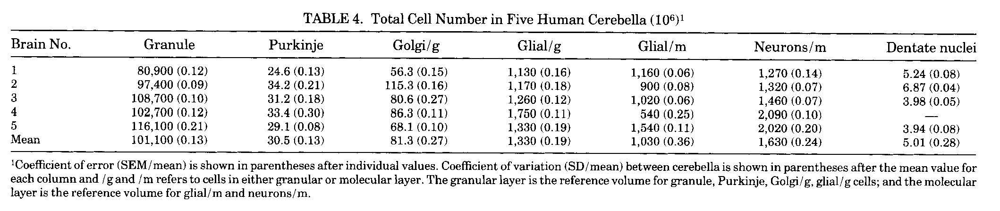

*******************************************************************************************************
AndersonBB+2-1992 - A quantitative study of the human cerebellum with unbiased stereological techniques
*******************************************************************************************************

Notes about :cite:`AndersonBB+2-1992` :footcite:`AndersonBB+2-1992`.

This paper has data giving the counts of some cell types in the human cerebellum.  The data is given
in Table 2 of the paper.

   Table 4 in AndersonBB+2-1992 :cite:`AndersonBB+2-1992`.

.. tbldata:: table_cell_counts
   :id_prefix: d

   Cell type       | Species   | Value           | Reference
   purkinje        | human     | 30.5 x 10^6     | AndersonBB+2-1992
   grannule        | human     | 101,000 x 10^6  | AndersonBB+2-1992
   dentate nucleus | human     | 5.01 x 10^6     | AndersonBB+2-1992
   golgi           | human     | 81.3 x 10^6     | AndersonBB+2-1992

.. footbibliography::
