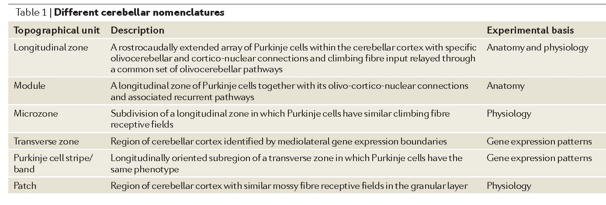
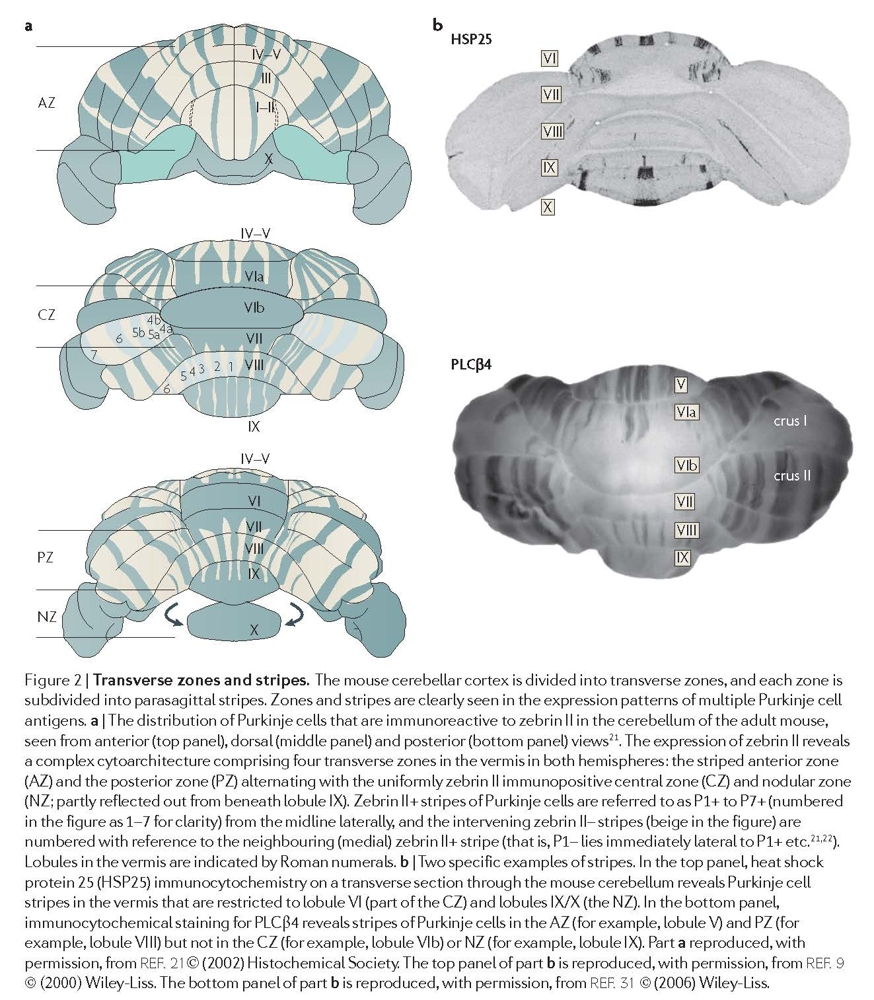
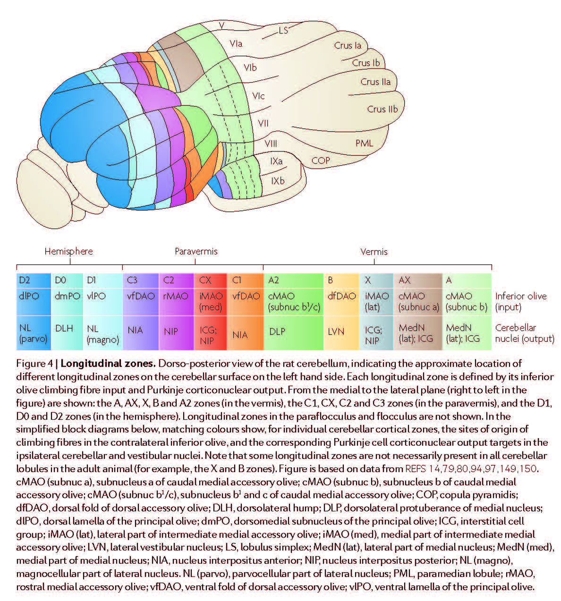

******************
AppsR+HawkesR-2009
******************

Notes about :cite:`AppsR+HawkesR-2009` :footcite:`AppsR+HawkesR-2009`.

.. footbibliography::

This paper describes different zones of the cerebellum.
   

   Table 1 in AppsR+HawkesR-2009 :cite:`AppsR+HawkesR-2009`.

p. 671

   **Transverse zones**
   Although anatomical, physiological and behavioural
   studies have emphasised a longitudinal organization
   within the cerebellar cortex (see later), developmental
   studies17,18 suggest that the development of the fundamental
   cerebellar architecture begins with the subdivision
   of the cerebellar cortex into five (or six in
   birds) transverse zones17 (FIG. 2)

   **Stripes**
   Every transverse zone is subdivided into a series of
   stripes (or ‘bands’) oriented along the rostrocaudal
   axis and which are defined by the restricted expression
   of molecular markers (FIG. 2). The most comprehensively
   studied molecular marker is zebrin II22, which
   cloning studies revealed to be the metabolic enzyme
   aldolase C23,24. Zebrin II is expressed by a subset of
   Purkinje cells (zebrin II+) that alternate with Purkinje
   cells that do not express this marker (zebrin II–), thus
   forming zebrin II+/– stripes (FIG. 2). The zebrin II+/–
   stripes are symmetrically distributed across the midline,
   highly reproducible between individuals22,25,26 and
   conserved across species (reviewed in REF. 27).
   
   

   Fig 2 in AppsR+HawkesR-2009 :cite:`AppsR+HawkesR-2009`.

p. 673:

   **Longitudinal zones**
   Numerous pathway tracing studies have revealed
   ‘longitudinal zones’ within the cerebellar cortex: narrow,
   rostrocaudally elongated regions that run perpendicular
   to the long axis of the lobules3,78–80 (FIG. 4). Longitudinal
   zones were originally defined by their topographically
   organized Purkinje cell output to different territories
   within the cerebellar and vestibular nuclei (the socalled
   A, b, C1, C2, C3, D1 and D2 longitudinal zones
   of Voogd; for a review of the earlier literature see REF. 2);
   additional longitudinal zones have subsequently been
   added, for example, X, CX and D0 (FIG. 4). A longitudinal
   zonal arrangement also holds true for the anatomy
   of olivocerebellar climbing fibre projections81 and for the
   pattern of termination of physiologically characterised
   spino-olivocerebellar pathways (as described originally
   by Oscarsson and co-workers82). In general, the maps of
   olivocerebellar connections defined by anatomical and
   physiological methods coincide, for example, see REF. 83.

   Fig 4 in AppsR+HawkesR-2009 :cite:`AppsR+HawkesR-2009`.

p. 674-675

Modules and microzones.
   
   Anatomical tract tracing has also been used to
   describe the way in which olivocerebellar (climbing fibre)
   afferents and corticonuclear (Purkinje cell) efferents are
   linked to form discrete complexes, the cortical component
   of each of these ‘modules’ being a longitudinal zone
   of Purkinje cells2,79. Anatomically defined modules have
   been extended to include other connections, notably
   the nucleo-olivary and reciprocal olivo-nuclear projections86.
   In the same way that Purkinje cell stripes are evolutionarily
   conserved, cerebellar modules are remarkably
   similar in a range of species (see Supplementary information
   S1 (table)). `S1 (table) <../_static/papers/AppsR+HawkesR-2009_supp.pdf>`_
   The behavioural significance of
   these modules is beyond the scope of this Review but
   their conservation implies that each subserves a similar
   function in different species (for example, regulation of
   spinal reflexes and limb movements by the paravermal
   modules87; and control of compensatory eye movements
   by modules in the flocculus88).
   
   Some longitudinal zones can be further split into
   smaller units called ‘microzones’82,89. In particular, highresolution
   electrophysiological mapping from medial
   to lateral across the width of the vermal b zone or the
   paravermal C3 zone shows small groups of Purkinje
   cells with distinct climbing fibre receptive fields that
   arise from different body parts. Each Purkinje cell group
   typically occupies a narrow, rostrocaudally oriented strip
   of cortex within the broader longitudinal zone (each
   zone ~1 mm and each microzone ~100–300 μm wide).
   microzones mapped in the vermal b zone form a regular
   array of olivo-cortico-nuclear ‘microcomplexes’ that are
   thought to control different aspects of the motor functions
   handled by the broader module82. However, the
   most extensively studied microzones lie within a small
   part of the C3 longitudinal zone in the paravermis of
   lobule V in cats, and their organization seems to be rather
   different89. Whereas individual microzones in the b zone
   are thought to extend the entire rostrocaudal length of
   the zone (more than 100 mm in cat)82, microzones in
   C3 tend to be much shorter, usually extending across no
   more than a few adjacent cerebellar folia. In addition,
   microzones located in different parts of the paravermal
   cortex can have the same climbing fibre receptive field
   characteristics (for example, there are at least four separate
   ‘eyeblink’ microzones in each paravermis90). This has
   led to the concept that spatially separated collections of
   microzones with common climbing fibre input — termed
   ‘multizonal microcomplexes’ — may be important for the
   parallel processing and integration of information from
   mossy fibre inputs derived from multiple sources3,89.
   
   Some anatomical data are consistent with such a possibility
   (for example, see REF. 91), but physiological studies
   to fully test this hypothesis are currently lacking.
   Anatomical tracer studies have also revealed a correspondingly
   detailed map within the inferior olive, with
   subgroups of olivary cells providing climbing fibres to
   different parts of the same longitudinal zone (for example,
   see REF. 92 and FIG. 4). In some cases the resolution of
   the anatomical mapping has been sufficient to reveal this
   connectivity at a level that might correspond to microzones93,94.
   Longitudinal zones are therefore most probably
   composite entities, and the basic operational unit of
   the cerebellar cortex is narrower, possibly an individual
   microzone or, in the case of the paravermis, an assembly
   of microzones forming a multizonal microcomplex3.
   

