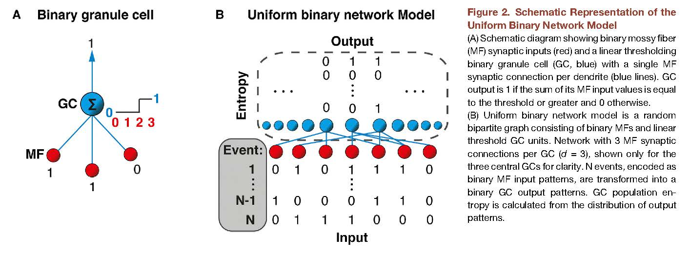
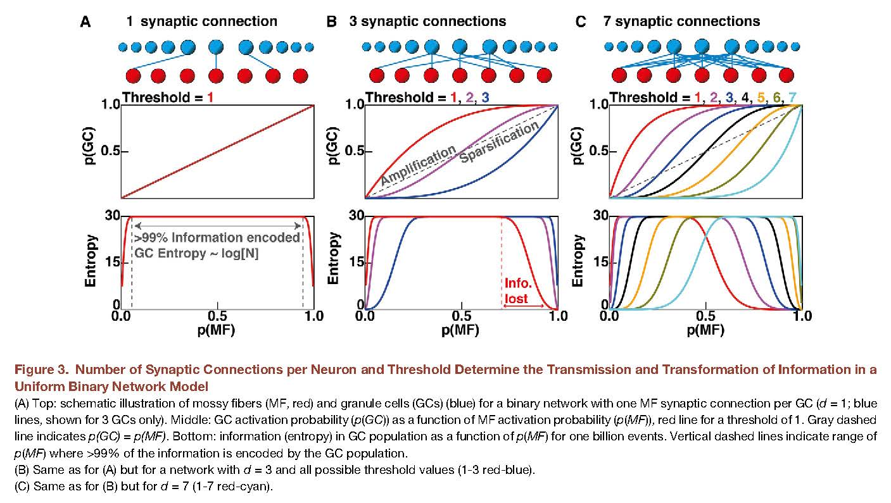

****************
BillingsG+4-2014
****************

Notes about :cite:`BillingsG+4-2014` :footcite:`BillingsG+4-2014`.

.. footbibliography::

This paper has data about the connections between mossy fibers and
granule cells in mouse and analysis showing that a small number
of inputs to granule cells (about 4) is most efficient for
transmitting information from mossy fibers to granule cells.

   Figure 2 in BillingsG+4-2014 :cite:`BillingsG+4-2014`.

   
   

   Fig 3 in BillingsG+4-2014 :cite:`BillingsG+4-2014`.

   

