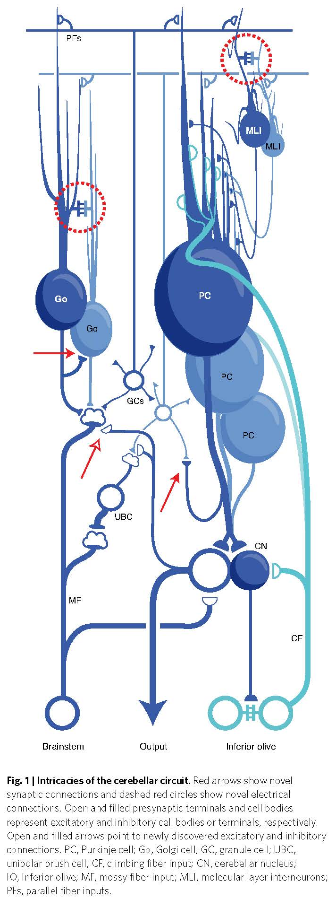

****************
DeZeeuwCI+2-2021
****************

Notes about :cite:`DeZeeuwCI+2-2021` :footcite:`DeZeeuwCI+2-2021`.

.. footbibliography::

This paper describes some recently discovered connections and changes
to the cortical circuit.  Specifically:

  The discovery of several new connections (Fig. 1, red) highlights a
  previously unappreciated level of recurrence in the cerebellar circuit.
  Mutual inhibition of like cell types is common: Purkinje cells inhibit
  other Purkinje cells :footcite:`WitterL+4-2016`, molecular layer interneurons inhibit other
  molecular layer interneurons in a way that is spatially highly structured
  :footcite:`RieublandS+2-2014`, :footcite:`ArltC+HausserM-2020`,
  and Golgi cells inhibit other Golgi cells :footcite:`HullC+RegehrWG-2012`. At the same time,
  previously hypothesized connections between molecular layer interneurons
  and Golgi cells have been ruled out :footcite:`HullC+RegehrWG-2012`. There also is electrical
  coupling among molecular layer interneurons5 and among Golgi cells :footcite:`DugueGP-2009+8`.
  Circuitry in the granule cell layer has the potential to filter and even
  reverse the sign of the input from mossy fibers, especially if it incorporates
  the unipolar brush cells7. In some regions, collaterals from
  Purkinje cells contact (inhibit) granule cells and create an additional recurrent
  connection in the input layer :footcite:`GuoC+5-2016`. Finally, neurons in the cerebellar nuclei
  provide feedback to the cerebellar cortex, via a mossy fiber-like projection
  that is subject to plastic changes during learning9,10.

   Figure 1 in De Zeeuw CI (2021) :cite:`DeZeeuwCI+2-2021`.

x
The newly discovered recurrent pathways may endow the cerebellar
cortex with an exceptional capacity for dynamic processing
and has led to suggestions of several new and previously unappreciated
neural computations. Electrical coupling, along with synaptic
inputs, could regulate the synchrony of functionally related clusters
of interneurons11,12 or could perform local functions for individual
neurons, such as linearization of dendritic integration13. The mossy
fiber feedback from the cerebellar nucleus could serve to organize
the different components of a movement sequence14 or relay a corollary
discharge that amplifies learned responses10.

