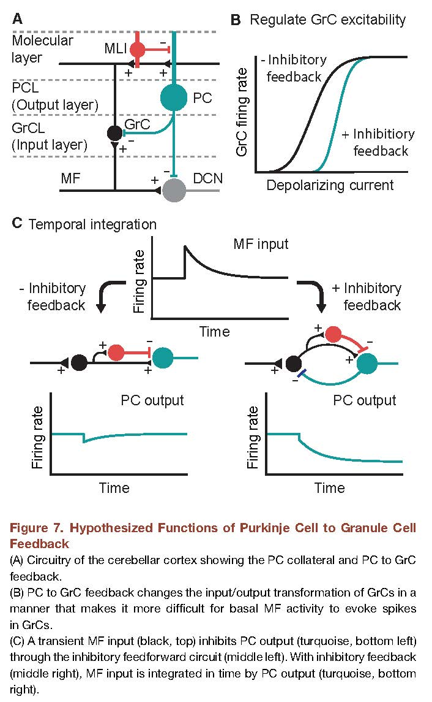

***********
GuoC+5-2016
***********

Notes about :cite:`GuoC+5-2016` :footcite:`GuoC+5-2016`.

.. footbibliography::

This paper shows that Purkinje Cell Collaterals inhibit granule cells in some regions.

From abstract:

   Inhibition of granule cells plays a key role in gating
   the flow of signals into the cerebellum, and it is
   thought that Golgi cells are the only interneurons
   that inhibit granule cells. Here we show that Purkinje
   cells, the sole output neurons of the cerebellar cortex,
   also directly inhibit granule cells via their axon
   collaterals. Anatomical and optogenetic studies
   indicate that this non-canonical feedback is region
   specific: it is most prominent in lobules that regulate
   eye movement and process vestibular information.
   Collaterals provide fast, slow, and tonic inhibition
   to granule cells, and thus allow Purkinje cells to
   regulate granule cell excitability on multiple timescales.
   We propose that this feedback mechanism
   could regulate excitability of the input layer, contribute
   to sparse coding, and mediate temporal
   integration.
   
     

   Figure 2 in GuoC+5-2016 :cite:`GuoC+5-2016`.

Comment: I don't understand why the purkinje cell firing rates
are decreasing in figure 5c.  I thought excitatory input
from mossy fibers would increase the firing of purkinje cells.

