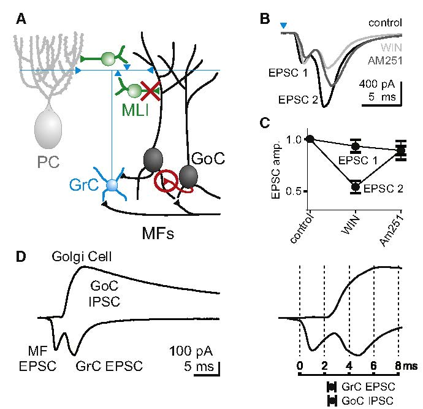
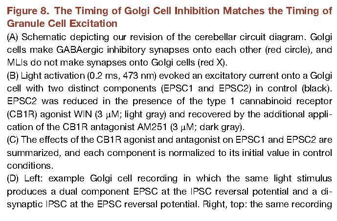

*******************
HullC+RegehrWG-2012
*******************

Notes about :cite:`HullC+RegehrWG-2012` :footcite:`HullC+RegehrWG-2012`.

.. footbibliography::

This paper shows that Molecular Layer Interneurons do not inhibit Golgi cells
and that Golgi cells inhibit each other through synaptic inhibition.

From abstract:

   In contrast
   to current thought, we find that Golgi cells, not
   MLIs, make inhibitory GABAergic synapses onto
   other Golgi cells. As a result, MLI feedback does
   not regulate the Golgi cell network, and Golgi cells
   are inhibited approximately 2 ms before Purkinje
   cells, following a mossy fiber input. Hence, Golgi
   cells and Purkinje cells receive unique sources of
   inhibition and can differentially process shared
   granule cell inputs.
        

   Figure 8 in HullC+RegehrWG-2012 :cite:`HullC+RegehrWG-2012`.

