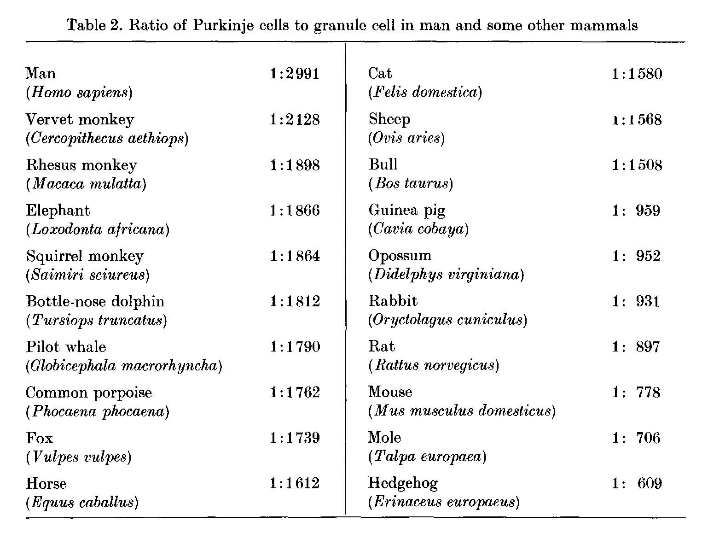

******************
LangeW-1975
******************

Notes about :cite:`LangeW-1975` :footcite:`LangeW-1975`.

.. footbibliography::

This paper has data on the Purkinje and granule cell ratio in different species.
   

   Table 2 in LangeW-1975 :cite:`LangeW-1975`.

