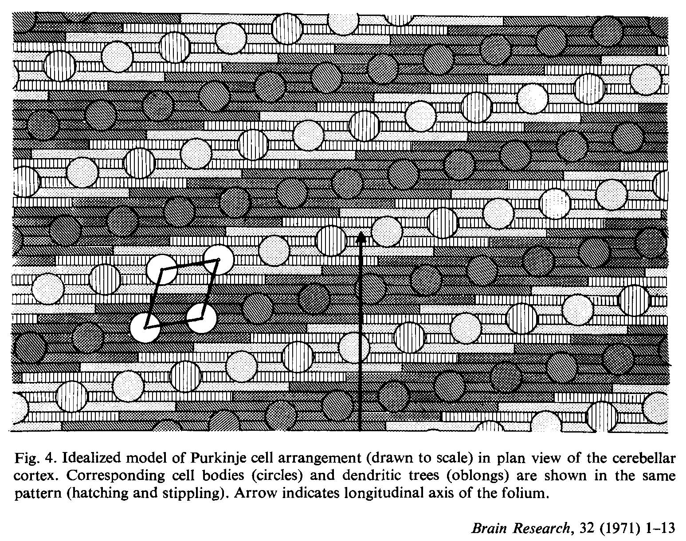

******************
PalkovitsM+2-1971a
******************

Notes about :cite:`PalkovitsM+2-1971a` :footcite:`PalkovitsM+2-1971a`.

.. footbibliography::

This paper has data about the Purkinje cells in the cat cerebellum.

   From page 9:
   Quantitative parameters are as follows: (a) the Purkinje cell density in the flat
   part of the folium is 384/sq.mm and the cortical surface area/Purkinje cell is 2604
   sq.um; (b) the width of the Purkinje cell dendritic tree (including the spaces between
   neighbouring dendritic arborizations) is 8.9/um and the dendritic spread is 292.5 um;
   and (c) the mean distance between Purkinje cells (centre of perikarya) is 51 /um.
   

   Figure 4 in PalkovitsM+2-1971a :cite:`PalkovitsM+2-1971a`.

From Summary:
   
   Purkinje cell numbers, densities and arrangement in space were studied by
   quantitative histology in the cerebella of adult cats. Calculated for the living state
   the density of the Purkinje cells was 373/sq.mm in entire folia (lobus paramedianus);
   the density in flattened parts of these folia was 384/sq.mm. The mean density calculated
   for the total living cerebellum was 330/sq.mm. The total number of Purkinje
   ceils was 1.2-1.3 million. On the basis of the known general principles of shape and
   arrangement in this study a new space arrangement model is suggested. Purkinje cell
   bodies are arranged in rows deviating by 11 ° from the transverse plane of the folium,
   and neighbouring cells are placed in a rhomboid pattern. In reality certain distortions
   of this pattern occur, in consequence of a flexibility in the relations of cell bodies to
   dendritic trees, but the essential correctness of the model can be proved statistically
   by distance measurements of Purkinje cells in randomly and in geometrically determined
   directions.
   

.. tbldata:: table_cell_counts
   :id_prefix: p

   Cell type   | Species   | Value         | Reference
   purkinje    | cat       | 1.25 x 10^6   | PalkovitsM+2-1971a

Range specified in the paper was 1.2-1.3 million.  1.25 million is
the average.

