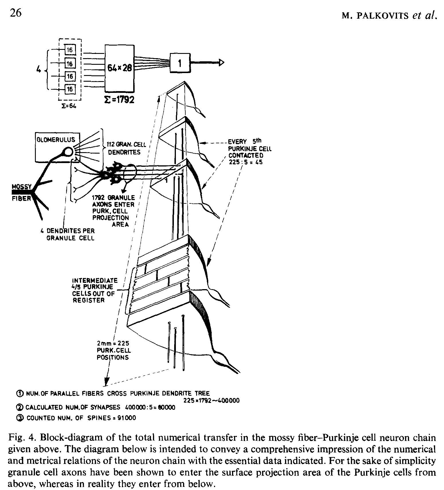

*****************
PalkovitsM+2-1972
*****************

Notes about :cite:`PalkovitsM+2-1972` :footcite:`PalkovitsM+2-1972`.

This paper give the ratio between mossy fibers, climbing fibers and purkinje cells in the
cat cerebellum and a circuit diagram showing the connections.

   Figure 4 in PalkovitsM+2-1972 :cite:`PalkovitsM+2-1972`.

"The mossy fiber-Purkinje cell ratio within the folium is thus 4:1."

From summary:
   
   About 96,000 fibers/sq.mm cross-sectional area enter through the medullary
   lamina at the base of cerebellar folia in the adult cat. Of these one-sixth are Purkinje
   axons, one-sixth climbing fibers and the remaining four-sixths of the total number of
   fibers crossing the base can be assumed to be mossy fibers. The mossy fiber-Purkinje
   cell ratio within the folium is thus 4:1.
   
   In 1 cu.mm of the granular layer 98,800 glomeruli are found on average (calculated
   for the living state) in homogeneous distribution and arranged isotropically in
   space. One mossy fiber breaks up (within a given folium) into about 16-17 mossy
   rosettes (glomeruli). According to earlier data [10] the granule cell-glomerulus ratio is
   27-28:1, the mossy fiber-granule cell ratio is therefore 1:460. The granule cells have
   4.17 dendrites, on average; the average mossy rosette is contacted by 112 granule
   dendrites. The number of postsynaptic units (dendrite digits) is 10.2/dendrite and
   1,142/glomerulus. Numerically, the granule cells belonging to one Purkinje cell
   (1,792) are capable of transmitting impulses from 4 mossy fibers and their 68 rosettes
   (glomeruli), while the parallel fibers, being 2 mm long, penetrate the dendrite trees of
   225 Purkinje cells. Since they establish synapses with only every fifth of these Purkinje
   cells, the calculated number of parallel fibers-Purkinje spine synapses would be 80,550/
   Purkinje cell 11. This calculated value agrees reasonably well with the counted number
   of Purkinje cell dendritic spines = 91,600.
   
   On the basis of this study series the numerical transfer model of the mossy fiber-
   Purkinje cell neuron chain can be constructed according to an all-over input-output
   ratio of 4:1. Further, the numerical, metrical and topological parameters of the
   divergence from mossy fibers through granule cells and parallel fibers, as well as those
   of the convergence at granule cell and Purkinje cell level can be established with
   reasonable accuracy. Since both the numerical and connectivity aspects of the entire
   neuron model are consistent with one another, and are based on numerous counts and
   measurements performed using a variety of independent approaches (either on the
   whole cerebellum or on representative parts), the connectivity model presented is
   suitable for realistic computer simulation models of the cerebellar cortex.
   

.. comment tbldata:: table_cell_counts
   :id_prefix: p

   Cell type   | Species   | Value         | Reference
   purkinje    | cat       | 1.25 x 10^6   | PalkovitsM+2-1971a

.. footbibliography::
