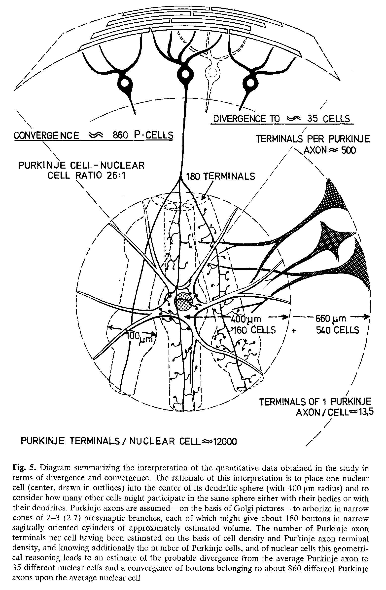

*****************
PalkovitsM+3-1977
*****************

Notes about :cite:`PalkovitsM+3-1977` :footcite:`PalkovitsM+3-1977`.

This paper give information about nuclear cells (Deep Cerebellar Nuceli) in cat.

From summary:
   
   Summary. The tissue volume, cell number, cell density, as well as the numbers
   and densities of various kinds of synaptic terminals were determined in
   the cerebellar nuclei of adult cats by means of stereological procedures
   both on the light and electron microscopic levels. The total number of the
   cerebellar nuclear cells was found to be 4.6x10^4. On the basis of
   karyometric studies the medial and interpositus nuclei appear to contain
   two, the lateral nucleus probably three different neuron populations. The
   over-all numerical ratio between Purkinje and nuc/ear cells is 26: 1.
   On the basis of simplified cytological and size criteria five different
   types of synaptic terminals were distinguished and counted separately. The
   total number of synaptic boutons was found to be 9.2x10^8, 62% of which
   (5.7x10^8) belong to Purkinje axons. The average number of synaptic
   boutorns per nuclear cell is 2x10^4 with systematic differences in the several
   nuclei (medial = 27500; interpositus = 18000; lateral = 13900). The
   number of boutons of Purkinje cell origin is 11600 per nuclear cell, on the
   average.
   
   The average number of synaptic bontons per Purkinje axon is 474,
   which are distributed in a space of about 13.5x10^6 um^3. In view of the
   density of the nuclear cells and the metric parameters of their dendrites, the
   number of nuclear cells with which synapses might be established is 35.
   This is a direct measure for the divergence; i.e. one Purkinje axon may
   reach potentially 35 nuclear cells. The number on any nuclear cell of
   boutons that originate from the same Purkinje axon would be mathematically
   13.5 as an average, but may vary excessively between 1 and around 50
   boutons. From these data the probable convergence of Purkinje axons
   upon nuclear cells can be deduced as being numerically somewhere around
   860, however, this apparently excessive value is mitigated by the Golgi observation
   that a single Purkinje axon may contribute to the same nuclear
   cell as many as 50 somatic synapses. The dendritic synapses - forming the
   vast majority of all contacts - are probably more evenly distributed among
   the great majority of the converging Purkinje axons but with correspondingly
   fewer individual contacts.
   

   Figure 5 in PalkovitsM+3-1977 :cite:`PalkovitsM+3-1977`.

   

.. comment tbldata:: table_cell_counts
   :id_prefix: p

   Cell type   | Species   | Value         | Reference
   purkinje    | cat       | 1.25 x 10^6   | PalkovitsM+2-1971a

.. footbibliography::
