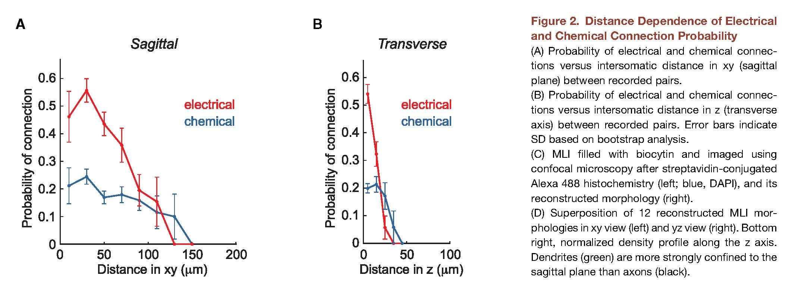

*****************
RieublandS+2-2014
*****************

Notes about :cite:`RieublandS+2-2014` :footcite:`RieublandS+2-2014`.

.. footbibliography::

This paper shows the difference between sagittal and transverse inhibition from
molecular interneurons in rat.

From Abstract:

   By recording from multiple molecular
   layer interneurons in the cerebellar cortex, we
   reveal specific, nonrandom connectivity patterns in
   both GABAergic chemical and electrical interneuron
   networks. Both networks contain clustered motifs
   and show specific overlap between them. Chemical
   connections exhibit a preference for transitive patterns,
   such as feedforward triplet motifs. This structured
   connectivity is supported by a characteristic
   spatial organization: transitivity of chemical connectivity
   is directed vertically in the sagittal plane, and
   electrical synapses appear strictly confined to the
   sagittal plane. The specific, highly structured connectivity
   rules suggest that these motifs are essential
   for the function of the cerebellar network.

From p. 923:
   
   Although
   classically MLIs have been divided into basket and stellate cells,
   our data support the accumulating evidence suggesting that
   these cells constitute a single population with a continuum of
   morphological properties with their position in the ML as main
   parameter: their dendrite length becomes gradually shorter the
   higher the interneuron is located in the ML
   

   

   Figure 2 in RieublandS+2-2014 :cite:`RieublandS+2-2014`.

