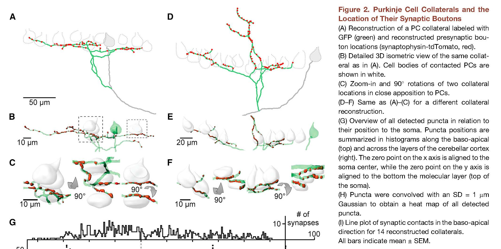

**************
WitterL+4-2016
**************

Notes about :cite:`WitterL+4-2016` :footcite:`WitterL+4-2016`.

.. footbibliography::

This paper shows that Purkinje cell collaterals Feed Back to Purkinje Cells
and Interneurons.  Experiments were done using mice.

p. 317:

     Collaterals were confined to a narrow
     sagittal plane but extended hundreds of micrometers within
     that plane.

     ... we estimate that each PC receives input from five to ten other PCs
     (Figure 4).  This is in good agreement with our estimates of
     convergence from our synaptic labeling experiments in which each PC
     forms synaptic contacts near approximately six to eight PCs (Figure
     2).  PC axon collateral synapses onto PCs and MLIs could regulate
     activity in narrow parasagittal strips, which are likely contained
     within broader zebrin bands that constitute functional units (Apps and
     Hawkes, 2009).  Both PC collaterals and MLI axons are restricted to
     narrow parasagittal planes (Gao et al., 2006; Hawkes and Leclerc,
     1989). Therefore, PC feedback regulates cerebellar activity at the
     output stage in these functionally delimited zones, and could
     potentially act to regulate the rate or timing of firing of PCs and
     MLIs.
     
     PC collaterals could allow the output of the cerebellar cortex to feed
     back and control the gain of the cerebellar cortex. Gain control by
     inhibitory feedback is a common mechanism to maintain the dynamic
     range of neural circuits. When principal output neurons are
     excitatory, inhibitory feedback requires interneurons as in the
     cerebral cortex (Olsen et al., 2012) and hippocampus (Freund and
     Buzsa ́ki, 1996). When output neurons are GABAergic, as in the basal
     ganglia and as described here for the cerebellum, gain control can be
     achieved by connections between the output cells (Brown et al.,
     2014). If PC collaterals control the firing rate of their targets,
     then PC-to-PC connections allow PC activity to suppress the output
     of the cerebellar cortex. In contrast, PC-to-MLI synapses would have
     the opposite effect and would suppress inhibition of MLIs to PCs,
     thereby providing positive feedback. The time course and extent of
     feedback on PC firing rates will thus depend on collateral con-
     nectivity and the balance of direct inhibition and indirect
     disinhibition.
     

   Figure 2 in WitterL+4-2016 :cite:`WitterL+4-2016`.

