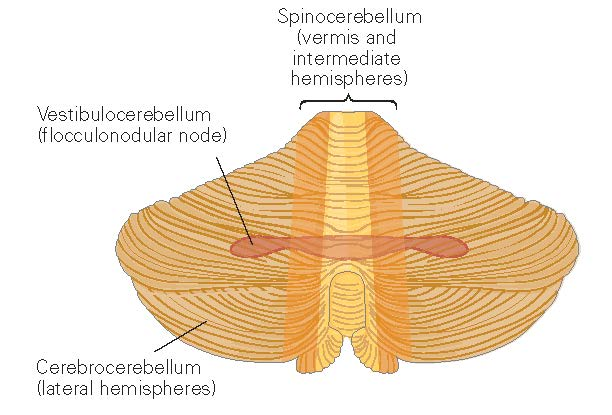
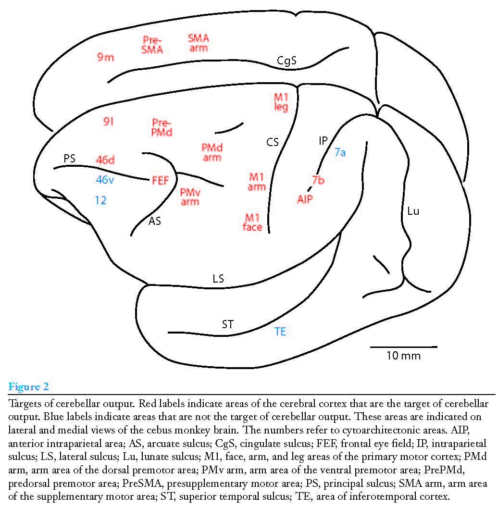
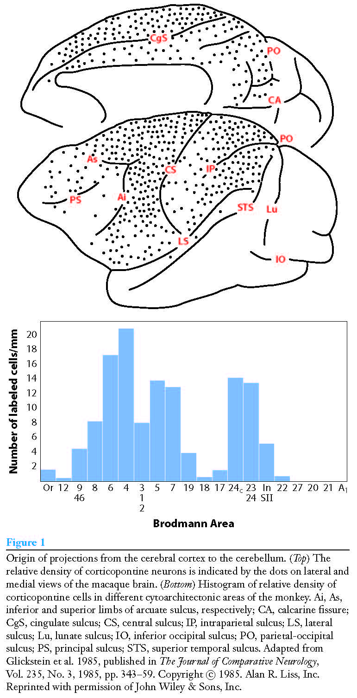

.. _connections:

Connections to / from the cerebellum
------------------------------------

   Figure 1. Functional regions of the cerebellum.  From :cite:`KandelER+4-2013` (figure 42.2).

   Figure 2. Projections from cerebellum to cortex.  From :cite:`StrickPL+2-2009`.

   Figure 3. Projections from cortex to cerebellum.  From :cite:`StrickPL+2-2009`.

Below text from :cite:`KandelER+4-2013`.

Vestibulocerebellum
-------------------

The Vestibulocerebellum Regulates Balance and Eye Movements

Inputs:

semicircular canals and the otolith organs, which sense the head’s motion and its position relative to gravity. Most of this vestibular input arises from the vestibular nuclei in the brain stem. The vestibulocerebellum also receives mossy fiber visual input, both from pretectal nuclei that lie deep in the midbrain beneath the superior colliculus and from the primary and secondary visual cortex through the pontine and pretectal nuclei.

Outputs:

The vestibulocerebellum is unique in that its output bypasses the deep cerebellar nuclei and proceeds directly to the vestibular nuclei in the brain stem. Purkinje cells in the midline parts of the vestibulocerebellum project to the lateral vestibular nucleus to modulate the lateral and medial vestibulospinal tracts, which predominantly control axial muscles and limb extensors to assure balance during stance and gait. Disruption of these projections through lesions or disease impairs equilibrium.
Purkinje neurons in the lateral parts of the vestibulocerebellum project to the medial vestibular nucleus to control eye movements and coordinate movements of the head and eyes. Interestingly, this ancient part of the cerebellum has been co-opted in more recent phylogeny by visual guidance of eye movements. In fact, the most striking deficits following lesions of the lateral vestibulocerebellum are in smooth-pursuit eye movement toward the side of the lesion.

Spinocerebellum
---------------

The Spinocerebellum Regulates Body and Limb Movements.

The spinocerebellum comprises the vermis and intermediate parts of the cerebellar hemispheres.

Inputs:

The spinocerebellum receives extensive sensory input from the spinal cord, mainly from somatosensory receptors conveying information about touch, pressure, and limb position, through several direct and indirect pathways. This input provides the cerebellum with different reports of the changing state of the organism and its environment and permit comparisons between the two.

Direct pathways originate from interneurons in the spinal gray matter and terminate as mossy fibers in the vermis or spinocerebellum. Indirect pathways from the spinal cord to the cerebellum terminate first on neurons in one of several precerebellar nuclei in the brain stem reticular formation: the lateral reticular nucleus, reticularis tegmenti pontis, and paramedian reticular nucleus.

One fundamental principle of cerebellar operation can be appreciated on the basis of two important pathways from the spinal interneurons. The ventral and dorsal spinocerebellar tracts both transmit signals from the spinal cord directly to the cerebellar cortex but convey two different kinds of information.
The dorsal spinocerebellar tract conveys somatosensory information from muscle and joint receptors, providing the cerebellum with sensory feedback about the consequences of the movement. This information flows whether the limbs are moved passively or voluntarily.
In contrast, the ventral spinocerebellar tract is active only during active movements. Its cells of origin receive the same inputs as spinal motor neurons and interneurons, and it transmits an efference copy or corollary discharge of spinal motor neuron activity that informs the cerebellum about the movement commands assembled at the spinal cord. The cerebellum is thought to compare this information on planned movement with the actual movement reported by the dorsal spinocerebellar tract in order to determine whether the motor command must be modified to achieve the desired movement. The dorsal and ventral spinocerebellar tracts provide inputs from the hind limbs, whereas the cuneocerebellar and rostral spinocerebellar tracts provide similar inputs from more rostral body parts.

Outputs:

The Spinocerebellum Modulates the Descending Motor Systems
Purkinje neurons in the spinocerebellum project soma- totopically to different deep nuclei that control vari- ous components of the descending motor pathways. Neurons in the vermis of both the anterior and pos- terior lobes send axons to the fastigial nucleus. The fastigial nucleus projects bilaterally to the brain stem reticular formation and lateral vestibular nuclei, which in turn project directly to the spinal cord (Figure 42–7).

Purkinje neurons in the intermediate part of the cerebellar hemispheres project to the interposed nucleus. Some axons of the interposed nucleus exit through the superior cerebellar peduncle and cross to the contralateral side of the brain to terminate in the magnocellular portion of the red nucleus. Axons from the red nucleus cross the midline again and descend to the spinal cord (Figure 42–9). Other axons from the interposed nucleus continue rostrally and terminate in the ventrolateral nucleus of the thalamus. Neurons in the ventrolateral nucleus project to the limb control areas of the primary motor cortex.
page 1021 (970)

The vermis may be the only area of the cerebellum responsible for saccades, but it seems to share responsibility for smooth pursuit with the lateral part of the flocculonodular lobe. The outputs from neurons of the vermis concerned with saccades are transmitted through a very small region of the caudal fastigial nucleus to the saccade generator in the reticular formation. The exact neural pathways for guidance of pursuit by the vermis are not known, but they involve more synaptic relays than the outputs from the lateral part of the flocculonodular lobe, which reach extraocular motor neurons through two intervening synapses. One idea currently being explored is that the vermis also plays a role in motor learning that corrects errors in saccades and smooth-pursuit movements.

 
Cerebrocerebellum
-----------------

The CerebrocerebellumIs Involved in Planning Movement

The Cerebrocerebellum Is Part of a High-Level Internal Feedback Circuit That Plans Movement and Regulates Cortical Motor Programs

Input:

In contrast to other regions of the cerebellum, which receive sensory information more directly from the spinal cord, the lateral hemispheres receive input exclusively from the cerebral cortex. This cortical input is transmitted through the pontine nuclei and through the middle cerebellar peduncle to the contralateral dentate nucleus and lateral hemisphere (see Figure 42–3).

Output:

Purkinje neurons in the lateral hemisphere project to the dentate nucleus. Most dentate axons exit the cerebellum through the superior cerebellar peduncle and terminate in two main sites. One terminus is an area of the contralateral ventrolateral thalamus that also receives input from the interposed nucleus. These thalamic cells project to premotor and primary motor cortex (see Figure 42–9).
The second principal terminus of dentate neurons is the contralateral red nucleus, specifically a portion of the parvocellular area of the nucleus distinct from that which receives input from the interposed nucleus. These neurons project to the inferior olivary nucleus, which in turn projects back to the contralateral cerebellum as climbing fibers, thus forming a recurrent loop (see Figure 42–6). Neurons in the parvocellular portion of the red nucleus, in addition to receiving input from the dentate nucleus, also receive input from the lateral premotor areas. On the basis of brain imaging, the intriguing suggestion has been made that this loop involving the premotor cortex, lateral cerebellum, and rubrocerebellar tract participates in the mental rehearsal of movements and perhaps in motor learning (see Chapter 33).

Interestingly, the active area of the dentate nucleus is the area that receives input from the part of the cerebral cortex (area 46) involved in working memory. The dentate nucleus appears to be particularly important in processing sensory information for tasks that require complex spatial and temporal judgments, which are essential for com- plex motor actions and sequences of movements.
